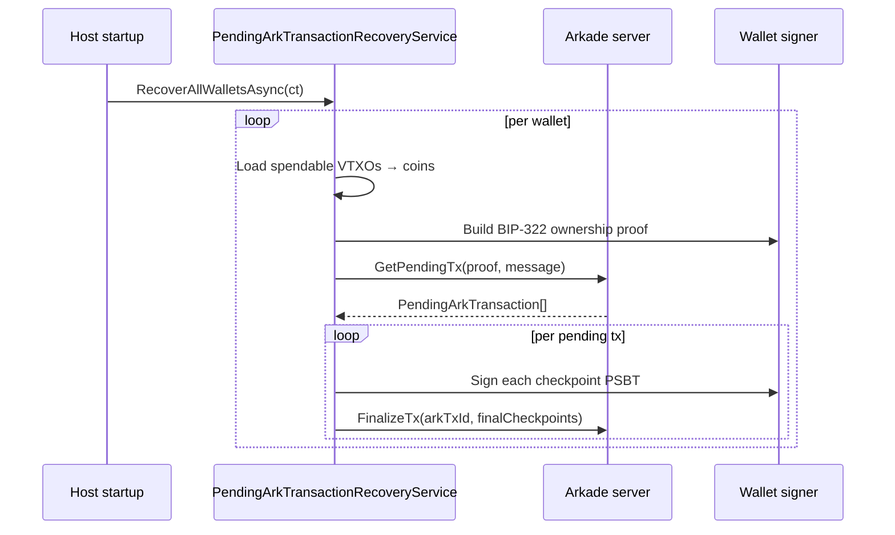

# Pending Arkade Transaction Recovery

Arkade off-chain transactions follow a **two-phase** flow:

1. **Submit** — the SDK calls `IClientTransport.SubmitTx(signedArkTx, signedCheckpoints)`. The Arkade server validates the inputs, locks them as *pending*, and returns the final ark tx + signed checkpoints.
2. **Finalize** — the SDK signs the checkpoint inputs and calls `IClientTransport.FinalizeTx(arkTxId, finalCheckpoints)`. The server settles the tx and releases the inputs back to the user's spendable set.

If the process crashes, the network drops, or the user closes the app **between** these two phases, the server still considers those inputs in-flight. Arkade enforces "you must finalize *that exact* pending tx; you cannot spend those inputs another way" — so without recovery the user's coins are indefinitely stuck.

`PendingArkTransactionRecoveryService` reconciles this. It pulls the server's view of pending transactions for each wallet and finalizes them locally.

## How it works



1. `RecoverAllWalletsAsync` is invoked from `ArkHostedLifecycle.StartAsync` *after* `VtxoSynchronizationService` has booted, so the local VTXO state is fresh enough to resolve checkpoint inputs.
2. For each wallet, the service collects every spendable VTXO and asks `ICoinService` to materialise it into an `ArkCoin`. Coins that can't be reconstructed (e.g. VHTLCs that need a preimage) are silently skipped — they are not valid proof material anyway.
3. Coins are batched in groups of 20 (the server's hard limit on inputs per intent). Each batch produces one BIP-322 ownership proof anchored on the batch's first coin and a `{"type":"get-pending-tx","expire_at":0}` envelope (matches the `go-sdk` and `ts-sdk` shape).
4. The server replies with every pending tx that targets any input owned by the proof's identity. Duplicates across batches are deduped by `ArkTxId`.
5. For each pending tx, every checkpoint PSBT input is resolved back to a local VTXO, the wallet signer fills the spending witness, and `FinalizeTx` is called.
6. Per-tx failures are scoped: they're logged at warning, raised on the `RecoveryFailed` event, and the loop continues with the next pending tx. One bad pending tx never blocks the rest of the batch — and the next service start retries any unfinalized leftovers.

## Setup

`AddArkCoreServices` registers the service and wires it into `ArkHostedLifecycle`, so the recovery sweep runs automatically once the host boots:

```csharp
services.AddArkCoreServices();
```

No additional registration is needed.

## Usage

The hands-off path is automatic — startup recovery sweeps every wallet known to `IWalletStorage`. For deterministic timing (e.g. immediately after a user unlock or a restored backup), invoke per-wallet recovery directly:

```csharp
var recovery = serviceProvider.GetRequiredService<PendingArkTransactionRecoveryService>();

var finalizedTxIds = await recovery.FinalizePendingArkTransactionsAsync(walletId, ct);
foreach (var txId in finalizedTxIds)
    Console.WriteLine($"Recovered & finalized pending tx {txId}");
```

`FinalizePendingArkTransactionsAsync` returns the `ArkTxId`s that were successfully finalized during the call.

## Reacting to recovery failures

Per-tx failures are logged but the loop never throws. Subscribe to `RecoveryFailed` to surface a non-blocking banner, ship telemetry, or schedule a retry:

```csharp
recovery.RecoveryFailed += (_, e) =>
{
    Logger.LogWarning(
        "Recovery failed for tx {ArkTxId} on wallet {WalletId}: {Error}",
        e.ArkTxId, e.WalletId, e.Exception.Message);

    // e.g. show a wallet-UI banner
    notifications.Push(
        $"Couldn't auto-finalize a pending Arkade tx ({e.ArkTxId}). " +
        "It will retry automatically next time the app starts.");
};
```

Subscribers must not throw — handler exceptions are observed and logged but never surfaced. Treat the event as a fire-and-forget signal.

## When recovery cannot help

- **No spendable VTXOs**. Recovery uses VTXO-anchored BIP-322 proofs; a wallet with zero spendable VTXOs has nothing to authenticate with. This is correct — a brand-new wallet has nothing to recover.
- **Local VTXO state out of sync**. Checkpoint inputs are resolved against `IVtxoStorage`. If a checkpoint references a VTXO the local index never saw, recovery throws *for that one tx* (the rest of the batch still proceeds). For HD wallets, run `HdWalletRecoveryService.ScanAsync` first, then re-trigger pending-tx recovery — the next host start does this automatically.
- **Signer not available**. If `IWalletProvider.GetSignerAsync` returns `null` (e.g. wallet locked, key custody gateway offline), recovery skips that wallet with a warning and tries again next start.

## Tuning notes

- **Idempotency**: safe to call `FinalizePendingArkTransactionsAsync` repeatedly. The server only returns pending txs that are still in flight; once finalized they disappear from subsequent responses.
- **Cost**: one BIP-322 signature per batch of 20 coins, then one `FinalizeTx` round-trip per pending tx. The typical wallet has zero pending txs, so the recovery sweep is a single signature + a single `GetPendingTx` round-trip per wallet.
- **Ordering**: recovery runs *after* `VtxoSynchronizationService` to give it the freshest local VTXO snapshot. This matters when checkpoint inputs reference VTXOs received in the same session that the crash happened in.
