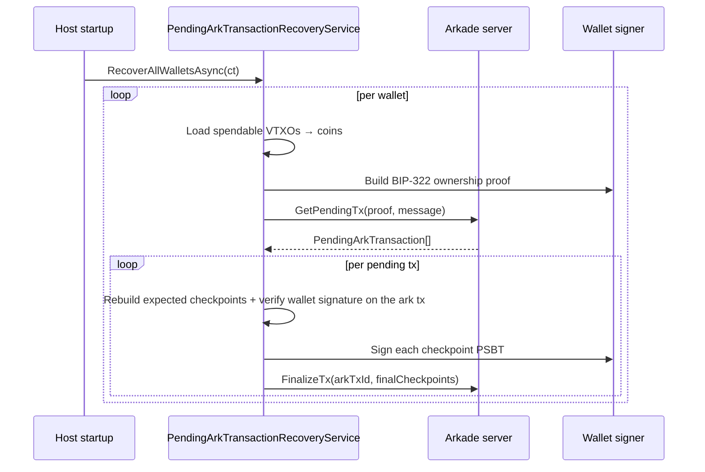

# Pending Arkade Transaction Recovery

Arkade off-chain transactions follow a **two-phase** flow:

1. **Submit** — the SDK calls `IClientTransport.SubmitTx(signedArkTx, signedCheckpoints)`. The Arkade server validates the inputs, locks them as *pending*, and returns the final ark tx + signed checkpoints.
2. **Finalize** — the SDK signs the checkpoint inputs and calls `IClientTransport.FinalizeTx(arkTxId, finalCheckpoints)`. The server settles the tx and releases the inputs back to the user's spendable set.

If the process crashes, the network drops, or the user closes the app **between** these two phases, the server still considers those inputs in-flight. Arkade enforces "you must finalize *that exact* pending tx; you cannot spend those inputs another way" — so without recovery the user's coins are indefinitely stuck.

`PendingArkTransactionRecoveryService` reconciles this. It pulls the server's view of pending transactions for each wallet and finalizes them locally.

## How it works


```mermaid
sequenceDiagram
    participant Host as Host startup
    participant Recovery as PendingArkTransactionRecoveryService
    participant Server as Arkade server
    participant Signer as Wallet signer

    Host->>Recovery: RecoverAllWalletsAsync(ct)
    loop per wallet
        Recovery->>Recovery: Load spendable VTXOs → coins
        Recovery->>Signer: Build BIP-322 ownership proof
        Recovery->>Server: GetPendingTx(proof, message)
        Server-->>Recovery: PendingArkTransaction[]
        loop per pending tx
            Recovery->>Recovery: Rebuild expected checkpoints + verify wallet signature on the ark tx
            Recovery->>Signer: Sign each checkpoint PSBT
            Recovery->>Server: FinalizeTx(arkTxId, finalCheckpoints)
        end
    end
```

1. `RecoverAllWalletsAsync` is invoked from `ArkHostedLifecycle.StartAsync` *after* `VtxoSynchronizationService` has booted, so the local VTXO state is fresh enough to resolve checkpoint inputs.
2. For each wallet, the service collects every spendable VTXO and asks `ICoinService` to materialise it into an `ArkCoin`. Coins that can't be reconstructed (e.g. VHTLCs that need a preimage) are silently skipped — they are not valid proof material anyway.
3. Coins are batched in groups of 20 (the server's hard limit on inputs per intent). Each batch produces one BIP-322 ownership proof anchored on the batch's first coin and a `{"type":"get-pending-tx","expire_at":0}` envelope (matches the `go-sdk` and `ts-sdk` shape).
4. The server replies with every pending tx that targets any input owned by the proof's identity. Duplicates across batches are deduped by `ArkTxId`.
5. For each pending tx, every checkpoint PSBT input is resolved back to a local VTXO, the whole pending tx is authorized locally (see below), the wallet signer fills the spending witness, and `FinalizeTx` is called.
6. Per-tx failures are scoped: they're logged at warning, raised on the `RecoveryFailed` event, and the loop continues with the next pending tx. One bad pending tx never blocks the rest of the batch — and the next service start retries any unfinalized leftovers.

## What recovery refuses to sign

A pending transaction is supplied entirely by the server, and the checkpoint signature the wallet is about to produce uses `SIGHASH_DEFAULT` — it commits to every output of the checkpoint. Recovery therefore authorizes the whole pending transaction against locally reconstructed expectations **before any signature is produced**, so it only ever signs a spend this wallet itself requested. Two things are checked:

1. **Every checkpoint must be the one this wallet would have built.** For each checkpoint input, the service resolves the local VTXO, rebuilds the checkpoint contract (this coin's spending leaf + the server unroll path, exactly as `ArkTransactionBuilder` builds it), and requires the checkpoint to have precisely two outputs: the input's **full** value paid to that contract, plus a zero-value P2A anchor. A checkpoint that pays anywhere else, pays a different amount, or carries extra outputs is rejected.
2. **The final ark tx must be one this wallet signed.** The checkpoint output is a 2-of-2 with the server *plus* a server-only unroll path that opens after a relative timeout, so a correctly shaped checkpoint on its own does not determine where the funds end up. The service re-parses `FinalArkTx`, requires it to hash to the advertised `ArkTxId` and to spend exactly the validated checkpoint outputs, and verifies this wallet's own BIP-340 signature over it for every input the wallet holds a key for. That signature commits to the ark tx's outputs and prevouts and only the wallet's key can produce it, so it is what pins the destination of the funds.

Failing either check raises `UnauthorizedPendingArkTransactionException` for that one pending tx: nothing is signed, `FinalizeTx` is not called, the failure is reported on `RecoveryFailed`, and the loop continues with the next pending tx. Recovery only ever completes a spend this wallet built and signed itself.

Two consequences worth knowing:

- Coins whose spending leaf names no wallet key (covenant paths such as an emulator-cosigned HTLC claim) skip the ark-tx signature check — the wallet never signs the ark tx for those inputs. Their checkpoint outputs are still validated in full.
- Local VTXO state must be fresh enough to resolve every checkpoint input, since the expected checkpoint contract is derived from the resolved coin. See *When recovery cannot help* below.

`UnauthorizedPendingArkTransactionException` means **the server presented something this wallet did not authorize**, and nothing else. Failures rooted in local state — a checkpoint input with no matching local VTXO, or a coin whose contract names no server key, so there is no expectation to compare against — surface as `InvalidOperationException` on the same `RecoveryFailed` event. Those say nothing about the server's behaviour; don't classify them as evidence of an attack.

## Setup

`AddArkCoreServices` registers the service and wires it into `ArkHostedLifecycle`, so the recovery sweep runs automatically once the host boots:

```csharp
services.AddArkCoreServices();
```

No additional registration is needed.

## Usage

The hands-off path is automatic — startup recovery sweeps every wallet known to `IWalletStorage`. For deterministic timing (e.g. immediately after a user unlock or a restored backup), invoke per-wallet recovery directly:

```csharp
var recovery = serviceProvider.GetRequiredService<PendingArkTransactionRecoveryService>();

var finalizedTxIds = await recovery.FinalizePendingArkTransactionsAsync(walletId, ct);
foreach (var txId in finalizedTxIds)
    Console.WriteLine($"Recovered & finalized pending tx {txId}");
```

`FinalizePendingArkTransactionsAsync` returns the `ArkTxId`s that were successfully finalized during the call.

## Reacting to recovery failures

Per-tx failures are logged but the loop never throws. Subscribe to `RecoveryFailed` to surface a non-blocking banner, ship telemetry, or schedule a retry:

```csharp
recovery.RecoveryFailed += (_, e) =>
{
    Logger.LogWarning(
        "Recovery failed for tx {ArkTxId} on wallet {WalletId}: {Error}",
        e.ArkTxId, e.WalletId, e.Exception.Message);

    // e.g. show a wallet-UI banner
    notifications.Push(
        $"Couldn't auto-finalize a pending Arkade tx ({e.ArkTxId}). " +
        "It will retry automatically next time the app starts.");
};
```

Subscribers must not throw — handler exceptions are observed and logged but never surfaced. Treat the event as a fire-and-forget signal.

## When recovery cannot help

- **No VTXOs at all (ever)**. Recovery uses VTXO-anchored BIP-322 proofs; a wallet that has never received a VTXO has nothing to authenticate with. Spent VTXOs are valid proof material — the proof only signs an identity message, it never spends the anchor — so a wallet whose only inputs are now in flight (the very scenario this service exists to handle) still has proof material.
- **Local VTXO state out of sync**. Checkpoint inputs are resolved against `IVtxoStorage`. If a checkpoint references a VTXO the local index never saw, recovery throws an `InvalidOperationException` *for that one tx* (the rest of the batch still proceeds). For HD wallets, run `HdWalletRecoveryService.ScanAsync` first, then re-trigger pending-tx recovery — the next host start does this automatically.
- **No expectation can be rebuilt**. If a checkpoint input resolves to a coin whose contract names no server key, the wallet cannot derive the checkpoint output it would itself have built, so it refuses to sign — again an `InvalidOperationException` scoped to that one tx, not an authorization failure.
- **The pending tx fails authorization**. A pending tx whose checkpoints or final ark tx don't match what this wallet built is never signed (see *What recovery refuses to sign*). It is reported on `RecoveryFailed` with an `UnauthorizedPendingArkTransactionException` and will keep being rejected on subsequent runs — it is a persistent mismatch to investigate, not a transient error.
- **Signer not available**. If `IWalletProvider.GetSignerAsync` returns `null` (e.g. wallet locked, key custody gateway offline), recovery skips that wallet with a warning and tries again next start.
- **Same-process race with the server projection**. Arkade marks input VTXOs as pending-spent via an async event projection that runs *after* `SubmitTx` returns. If you call `FinalizePendingArkTransactionsAsync` in the same process that just crashed mid-Submit, the first call may return an empty list because the projection hasn't caught up yet — retry briefly (the projection is typically caught up within a second). The hands-off startup path never races this; by the time the host restarts, the projection has long since run.

## Tuning notes

- **Idempotency**: safe to call `FinalizePendingArkTransactionsAsync` repeatedly. The server only returns pending txs that are still in flight; once finalized they disappear from subsequent responses.
- **Cost**: one BIP-322 signature per batch of 20 coins, then one `FinalizeTx` round-trip per pending tx. The typical wallet has zero pending txs, so the recovery sweep is a single signature + a single `GetPendingTx` round-trip per wallet.
- **Ordering**: recovery runs *after* `VtxoSynchronizationService` to give it the freshest local VTXO snapshot. This matters when checkpoint inputs reference VTXOs received in the same session that the crash happened in.
